# Goal Map

The macro goal stays stable. Medium-to-large micro goals are the only roadmap units shown here; individual coding tasks live in plans and the build tracker.

```mermaid
flowchart LR
  M["Macro goal: finished talking-head video in minutes through chat, point, and draw"]
  G0["G0 Foundation and continuity"]
  G1["G1 Interface design and renderer spike"]
  G2["G2 Canonical project foundation"]
  G3["G3 First closed manual vertical slice"]
  G4["G4 First AI-operated edit"]
  G5["G5 Editorial timeline primitives"]
  G6["G6 Motion, effects, and composition primitives"]
  G7["G7 Versioned component platform"]
  G8["G8 Trustworthy local alpha"]
  G9["G9 API and MCP surfaces"]
  G10["G10 Full production SaaS operations"]
  G11["G11 Advanced vision and tracking"]
  G12["G12 Data flywheel and specialized models"]

  M --> G0 --> G1 --> G2 --> G3 --> G4 --> G5 --> G6 --> G7 --> G8 --> G9 --> G10 --> G11 --> G12
```

## Status

| Goal | Outcome | Status | Exit evidence |
|---|---|---|---|
| G0 | Durable product truth, governance, architecture constraints, and approved next plan | Complete | Local verification, coherent commit, remote baseline, owner approval |
| G1 | Approved Studio workflow plus measured renderer decision | In progress | Usability walkthrough and reproducible spike results |
| G2 | Minimal typed project/action/history/render foundation | Pending | Contract and persistence tests |
| G3 | Upload → select time/region → static nameplate → preview → accept/undo → export | Pending | Real exported fixture and owner walkthrough |
| G4 | Natural-language request becomes a safe structured edit proposal | Pending | Fail-closed interpretation tests and owner approval loop |
| G5 | Cut, trim, split, ripple, reorder, and simple timeline operations | Pending | Exact timeline invariants and end-to-end workflows |
| G6 | Transform, keyframes, easing, spring/bounce, transitions, and basic effects | Pending | Deterministic render comparisons and usable controls |
| G7 | Reusable versioned editing components and templates | Pending | Compatibility and migration tests |
| G8 | Reliable local product used on real videos | Pending | Measured completion time, recovery, and quality data |
| G9 | Stable API/MCP access over the same domain engine | Pending | Contract, auth-boundary, and idempotency tests |
| G10 | Auth, tenancy, billing, queues, cloud storage/rendering, security, and operations | Pending | Production readiness and operational evidence |
| G11 | Object understanding, tracking, segmentation, and advanced spatial edits | Pending | Dataset-backed quality and failure-mode evidence |
| G12 | Learning loop and specialized models where data proves value | Pending | Privacy, evaluation, and measurable improvement |

## Anti-drift measurement

At every goal exit, compare the observed result against the macro goal using four measures:

1. Time-to-finished-video
2. Amount of editor knowledge required
3. Percentage of requested edits accepted without manual repair
4. Recovery quality when interpretation or rendering fails

Do not use a single invented “percentage complete.” Each goal closes only on its own evidence gate.
