# Goal Map

This is the compact roadmap view. The full definitions, dependencies, consequences, and exit gates live in `MASTER_PLAN.md`. Every tickable item lives in `plans/PLAN_CHECKLIST.md`; implementation detail lives in the linked micro plans.

```mermaid
flowchart LR
  M["Macro: a non-editor finishes a verified talking-head video in minutes"]
  G0["G0 Foundation"]
  G1["G1 UX and renderer evidence"]
  G2["G2 Project foundation"]
  G3["G3 Manual closed loop"]
  G4A["G4-A Scale-ready Project v2 chassis"]
  G4B["G4-B First AI proposal"]
  G5A["G5-A Captions"]
  G5B["G5-B Timeline primitives"]
  G5C["G5-C Useful talking-head workflow"]
  G6["G6 Motion and effects"]
  G7["G7 Components and compound AI"]
  G8["G8 Trustworthy local alpha"]
  G9["G9 External API/MCP if justified"]
  G10["G10 Production SaaS"]
  G11["G11 Advanced vision"]
  G12["G12 Data and specialized models"]

  M --> G0 --> G1
  G1 --> G2 --> G3 --> G4A
  G4A --> G4B
  G4A --> G5A
  G4A --> G5B
  G4B --> G5C
  G5A --> G5C
  G5B --> G5C
  G5C --> G6 --> G7 --> G8
  G8 -. conditional .-> G9
  G8 -. conditional .-> G10
  G9 -. may support .-> G10
  G8 -. evidence .-> G11 --> G12
```

## Status

Legend: `[x]` complete, `[~]` partly complete or awaiting owner evidence, `[ ]` not started, `[?]` conditional.

| Goal | Outcome | Status |
|---|---|---|
| G0 | Durable product truth, governance, architecture constraints, and rollback baseline | [x] |
| G1 | Owner-tested Home-to-Studio workflow and renderer evidence | [~] Owner motion, native drag-and-drop, and final Studio UX evidence remain open |
| G2 | Minimal typed project/action/history/render foundation | [x] |
| G3 | Upload through persisted accepted edit and downloadable MP4 | [x] |
| G4-A | Project v2 semantics, capability registry, change sets, render plan, and migration seam | [x] Complete |
| G4-B | Natural language becomes a safe pending edit proposal | [~] Fake-provider closed loop complete; first real provider call awaits owner keys/data decision |
| G5-A | Correct, reviewable captions | [x] Complete for transcript-sidecar workflow |
| G5-B | Cut, trim, split, ripple, reorder, audio level, and fades | [x] Complete in domain, preview, export, direct controls, and Timeline V1 |
| G5-C | A genuinely useful talking-head workflow combining AI, captions, and timeline work | [~] Technical workflow exists; repeated owner/non-editor evidence remains open |
| G6 | Transform, keyframes, easing, bounce, transitions, and basic effects | [~] Executable technical batch complete; owner workflow/performance evidence remains open |
| G7 | Versioned reusable components and compound AI plans | [~] Significant technical slices exist; full goal exit remains open |
| G8 | Recoverable, measurable local alpha used on real videos | [~] Technical controls complete; owner workflows, representative users, and agreed budgets remain open |
| G9 | Stable external API/MCP over the same engine | [?] Build only when an external-client use case is proven |
| G10 | Identity, tenancy, cloud jobs/storage/rendering, billing, security, and operations | [?] Enter when local-alpha evidence and distribution intent justify SaaS |
| G11 | Tracking, segmentation, occlusion, and advanced spatial editing | [?] Evidence-driven |
| G12 | Evaluation flywheel, routing, and specialized models | [?] Consent- and data-driven |

## Current position

- G4-A's exact-time project/change-set/render chassis is complete and remains authoritative.
- The fake-provider AI proposal loop, transcript captions, cutting/audio primitives, motion/effect slices, recovery controls, Production Timeline V1, Inspector V1, and Canvas Direct Manipulation V1 exist in executable code.
- P1-E Media Bin V1 is technically complete with real-browser/media/export evidence. One accepted project now feeds one Media view model, one display-label authority, one usage index, and App-owned source probing; `UX-011` is resolved. The next interface milestone is P1-F only after explicit owner instruction.
- G1 and the later workflow/local-alpha exits retain owner-only evidence gaps; automation cannot truthfully close native feel, final UX judgment, repeated non-editor workflows, or agreed performance budgets.
- The first real AI-provider call remains blocked on the owner's keys and explicit decision about data leaving the machine.
- Conditional cloud/SaaS/API goals remain conditional; technical progress does not silently authorize them.

## Anti-drift measurement

At every goal exit, record:

1. Median time from import to acceptable export.
2. Editor knowledge the user needed.
3. Proposal acceptance without manual repair.
4. Preview/export agreement.
5. Failure recovery quality.
6. Preservation of source media, history, and project reopenability.
7. Exact evidence level: unit, integration, real media, real browser, or owner acceptance.

Never publish one invented percentage-complete number. A box closes only when its named evidence exists.
