# Goal Map

The macro goal stays stable. Medium-to-large micro goals are the only roadmap units shown here; individual coding tasks live in plans and the build tracker.

```mermaid
flowchart LR
  M["Macro goal: finished talking-head video in minutes through chat, point, and draw"]
  G0["G0 Foundation and continuity"]
  G1["G1 Interface design and renderer spike"]
  G2["G2 Canonical project foundation"]
  G3["G3 First closed manual vertical slice"]
  G4["G4 First AI-operated edit"]
  G5["G5 Editorial timeline primitives"]
  G6["G6 Motion, effects, and composition primitives"]
  G7["G7 Versioned component platform"]
  G8["G8 Trustworthy local alpha"]
  G9["G9 API and MCP surfaces"]
  G10["G10 Full production SaaS operations"]
  G11["G11 Advanced vision and tracking"]
  G12["G12 Data flywheel and specialized models"]

  M --> G0 --> G1 --> G2 --> G3 --> G4 --> G5 --> G6 --> G7 --> G8 --> G9 --> G10 --> G11 --> G12
```

## Status

Legend: ✅ complete · 🟡 partly complete/open evidence gate · ⬜ not started

| Goal | Outcome | Status | Exit evidence |
|---|---|---|---|
| G0 | Durable product truth, governance, architecture constraints, and approved next plan | ✅ Complete | Local verification, coherent commits, remote baseline, and owner approval |
| G1 | Owner-tested runnable Home-to-Studio workflow plus measured renderer decision | 🟡 In progress | The application and renderer decision work; final owner approval of motion, native drag-and-drop, and overall Studio UX remains open |
| G2 | Minimal typed project/action/history/render foundation | ✅ Complete | Typed/versioned nameplate actions, validation, immutable history, undo/redo, persisted project state, renderer boundary, and 220 passing workspace tests |
| G3 | Upload → select time/region → static nameplate → preview → accept/undo → persist → export | ✅ Complete | Real-video browser workflow, reopened history, correct downloaded MP4, preserved source, and preview/export nameplate fidelity evidence |
| G4 | Natural-language request becomes a safe structured edit proposal | ⬜ Next — not started | Requires a provider-independent intent boundary, structured validation, clarification, fail-closed behavior, preview, and owner approval before execution |
| G5 | Cut, trim, split, ripple, reorder, and simple timeline operations | ⬜ Not started | Exact timeline invariants and end-to-end workflows |
| G6 | Transform, keyframes, easing, spring/bounce, transitions, and basic effects | ⬜ Not started | Deterministic render comparisons and usable controls |
| G7 | Reusable versioned editing components and templates | ⬜ Not started | Compatibility and migration tests |
| G8 | Reliable local product used on real videos | ⬜ Not started | Measured completion time, recovery, and quality data |
| G9 | Stable API/MCP access over the same domain engine | ⬜ Not started | Contract, auth-boundary, and idempotency tests |
| G10 | Auth, tenancy, billing, queues, cloud storage/rendering, security, and operations | ⬜ Not started | Production readiness and operational evidence |
| G11 | Object understanding, tracking, segmentation, and advanced spatial edits | ⬜ Not started | Dataset-backed quality and failure-mode evidence |
| G12 | Learning loop and specialized models where data proves value | ⬜ Not started | Privacy, evaluation, and measurable improvement |

## Current position

- ✅ The deterministic manual nameplate loop is complete from upload through persisted history and downloaded export.
- 🟡 G1 remains open only for the owner's final interaction and motion-quality acceptance; this must not be misreported as finished.
- ⬜ G4 is the next major implementation goal: one natural-language request must become one safe, validated, previewable nameplate proposal that cannot execute without user approval.
- ⬜ Timeline primitives, motion/effects, reusable components, local-alpha hardening, external APIs, SaaS operations, advanced vision, and the learning loop remain later goals.

## Anti-drift measurement

At every goal exit, compare the observed result against the macro goal using four measures:

1. Time-to-finished-video
2. Amount of editor knowledge required
3. Percentage of requested edits accepted without manual repair
4. Recovery quality when interpretation or rendering fails

Do not use a single invented “percentage complete.” Each goal closes only on its own evidence gate.
