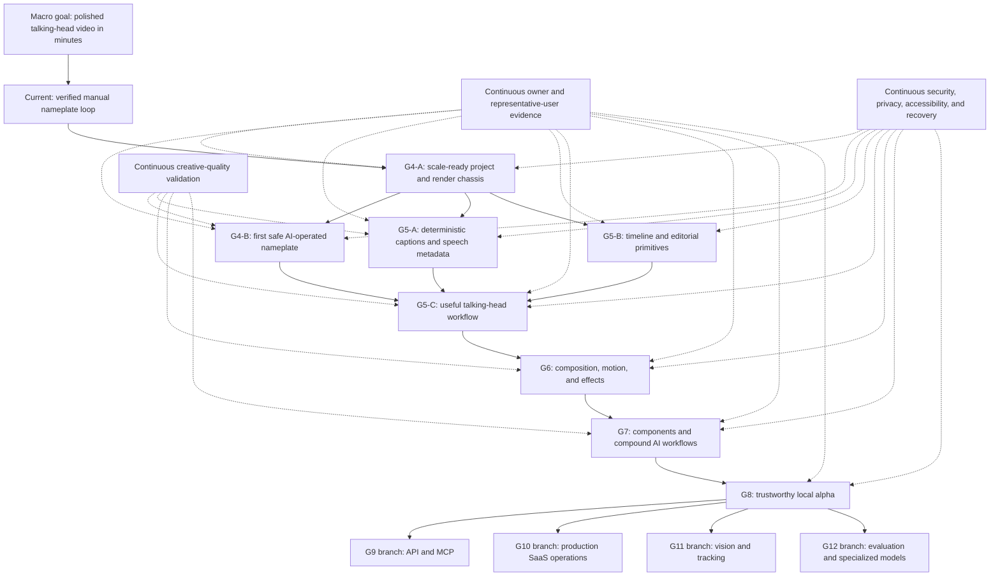

# Sanverse Stage 2 Canonical Master Plan

Status: **Proposed for owner approval**

Last updated: 2026-07-27

This is the canonical long-term roadmap. It defines the macro goal, dependency
order, goal boundaries, cross-cutting quality tracks, consequence map, and
evidence gates. Detailed tasks live in:

- `DOCS/plans/COMPLETE_MICRO_PLAN.md`
- `DOCS/plans/G4A_ATOMIC_IMPLEMENTATION_PLAN.md`
- `DOCS/plans/CROSS_CUTTING_VALIDATION_PLAN.md`
- `DOCS/plans/PLAN_CHECKLIST.md`

No product implementation is authorized merely because this plan exists. Each
medium-to-large goal still requires owner entry approval.

---

## 1. Single job of the complete system

Take:

- one cleaned talking-head video from Stage 1;
- optional transcript, word timings, cut map, or other sidecar data;
- natural user intent expressed through chat, pointing, drawing, selection,
  and simple direct manipulation;

and produce:

- an editable, non-destructive project;
- a concrete preview of every consequential proposed change;
- a polished, verified MP4 export;
- in minutes rather than hours;
- without requiring the user to learn a professional video editor.

The system is not complete when it generates code, actions, previews, or an
MP4 that is merely technically valid. It is complete only when representative
non-editors repeatedly finish acceptable real videos inside measured time,
quality, and recovery budgets.

## 2. Product boundary

### Stage 2 owns

- cleaned-video intake;
- optional Stage 1 sidecar intake;
- project creation and persistence;
- chat, point, draw, select, and direct-manipulation intent capture;
- deterministic editing;
- preview, clarification, approval, repair, history, undo, and redo;
- local and later cloud rendering;
- verified MP4 export;
- an optional delivery manifest such as chapter timestamps.

### Stage 2 does not currently own

- thumbnail creation;
- YouTube title or description generation;
- channel authentication;
- upload or publishing;
- analytics after publication;
- full Premiere Pro, DaVinci Resolve, CapCut, or After Effects parity.

Publishing may become a separate Stage 3 or an integration. It must not be
silently added to Stage 2 because it introduces external side effects,
authentication, platform failures, and a materially larger product boundary.

## 3. Accuracy and trust contract

Deterministic operations can be exact within their declared contract.
Semantic interpretation cannot honestly be guaranteed at 100%.

The product approaches near-perfect outcome reliability by combining:

1. strict typed capabilities;
2. deterministic bounds and project validation;
3. clarification when intent is ambiguous;
4. real preview before acceptance;
5. direct manual repair;
6. atomic acceptance and undo;
7. fail-closed behavior for unsupported or stale proposals;
8. real-media verification;
9. measured evaluation rather than model confidence.

AI never directly changes project files, invokes FFmpeg, writes renderer code,
or calls arbitrary operations. AI may return only an untrusted candidate.
Deterministic application code validates and turns it into a pending proposal.

## 4. Construction doctrine

### 4.1 Vertical slices are the top-level rule

Every capability is built through the complete chain:

```text
user outcome
  -> typed domain operation
  -> deterministic validation
  -> canonical render plan
  -> browser preview
  -> final renderer
  -> preview/export comparison
  -> manual repair
  -> AI interpretation where useful
  -> persistence and migration
  -> real-video owner test
```

Never build all backend primitives, then all UI, then all AI. That creates a
large unverified foundation with no usable product.

### 4.2 Modular monolith first

Start as one deployable application with explicit internal modules and
replaceable ports. Do not create microservices until measured scaling, fault
isolation, deployment, or team ownership proves they are necessary.

### 4.3 Strict executable core, preserved extensions

- Executable project and edit fields are strict and versioned.
- Unknown executable action kinds fail loudly.
- Unknown executable edits are never skipped during preview or export.
- Non-executable metadata may live only in bounded, namespaced extension maps.
- Unknown extensions must round-trip unchanged through read and save.
- Migrations are required for semantic or structural change, not every new
  decorative note or UI preference.

### 4.4 Three capability levels

| Level | Meaning | Examples |
|---|---|---|
| Primitive | Small deterministic operation | split clip, add overlay, animate scale |
| Component or recipe | Versioned assembly of primitives | captions, nameplate, callout, bouncy title |
| Outcome workflow | User-level goal expanded by the planner | tighten intro, caption section, polish video |

The AI normally selects an outcome or component. Deterministic planning expands
it into primitives. This prevents a flat registry from being either too coarse
for users or too large for reliable model selection.

### 4.5 Creative quality is separate from correctness

Each capability has two independent gates:

1. **Correctness:** Does it render safely, reproducibly, and as specified?
2. **Creative quality:** Is it legible, attractive, appropriately timed, and
   good enough for the owner's channel?

The initial creative direction is black, white, and grayscale. Reference
videos and frames are evidence, not instructions to copy another creator.

### 4.6 The "billion-dollar CTO" gate is an engineering checklist

The owner's quality question is preserved, but it must not become vague
gold-plating. Before accepting a code change, answer:

1. Is the user outcome and approved requirement explicit?
2. Is the invariant owned by the correct module?
3. Is one canonical representation used instead of parallel truths?
4. Are external providers, storage, rendering, and UI behind replaceable
   boundaries where replacement is realistically needed?
5. Are invalid, stale, unauthorized, and partially failed states handled
   explicitly?
6. Are schema evolution, migration, rollback, observability, security, and
   recovery proportionate to the current goal?
7. Is the change the smallest coherent vertical slice with evidence?
8. Did we avoid speculative layers, services, abstractions, or features that
   have no approved user workflow?

A change fails this gate if it is brittle or if it is over-engineered. Both
create long-term cost.

## 5. Current verified position

| Goal | State | Evidence boundary |
|---|---|---|
| G0 Foundation and continuity | Complete | Durable docs, Git baseline, private remote |
| G1 Interface and renderer feasibility | Partly open | Technical shell and first renderer decision exist; owner motion/native drag-and-drop acceptance remains open |
| G2 Narrow v1 edit foundation | Complete for the nameplate slice | Typed action/history/persistence tests and live reopen evidence |
| G3 Manual nameplate vertical slice | Complete | Real browser, real media, persisted history, export, download, output inspection |
| G4-A Scale-ready chassis | Not started | Proposed plan only |
| G4-B First safe AI edit | Not started | Proposed plan only |
| G5 and later | Not started | Roadmap only |

The existing `sanverse.project/v1` is sufficient for the completed nameplate
slice. It is not sufficient for scalable cuts, captions, assets, tracks,
compound requests, selective edit repair, or stale-plan protection.

## 6. Dependency roadmap



This is a dependency graph, not one unconditional feature conveyor belt.
G9-G12 are branches chosen using evidence after G8. They are not mandatory in
numeric order.

## 7. Goal definitions

### G4-A - Scale-ready project and render chassis

**Outcome:** Existing projects migrate safely to a minimal Project v2 that can
address assets, clips, time, geometry, change sets, revisions, capabilities,
and renderer-neutral output without changing the visible nameplate behavior.

**Must establish:**

- rational, JSON-safe time representation;
- half-open time ranges;
- source, clip, and composition time spaces;
- immutable asset identity and bounded media metadata;
- one composition with stable track and clip IDs;
- explicit geometry and anchor semantics;
- project revision and stale-plan rejection;
- atomic change sets;
- selective change-set deactivation with dependency revalidation;
- strict executable schemas;
- preserved namespaced extensions;
- versioned migration registry and v1-to-v2 rollback;
- three-level capability registry;
- canonical render specification used by preview and export;
- minimal local background-job contract without cloud infrastructure.

**Exit:** The v1 project fixture migrates idempotently, the existing real
nameplate loop still works, invalid times cannot enter accepted state, one
change set equals one undo, stale proposals fail closed, and preview/export
honor one canonical nameplate specification.

### G4-B - First safe AI-operated edit

**Outcome:** The user describes a nameplate naturally, optionally after
pointing, and receives a safe previewable proposal that cannot execute without
approval.

**Order:**

1. provider-independent intent contract;
2. deterministic fake provider;
3. capability selection and argument validation;
4. clarification and fail-closed behavior;
5. direct proposal repair;
6. atomic approval;
7. evaluation corpus;
8. one real provider behind an outbound data allowlist.

**Exit:** Representative prompts, ambiguity, malicious text, stale revisions,
unsupported capability requests, and provider failures behave safely. Provider
switching cannot change the canonical edit contract.

### G5-A - Deterministic captions and speech metadata

**Outcome:** The user can import or produce timed transcript data, generate
captions, correct them, style them, preview them, and export them without AI
being a hard dependency.

**Build:** Stage 1 sidecar adapter, optional transcription adapter, word timing,
caption segmentation, text correction, timing correction, caption components,
style profile, render-plan nodes, browser preview, export rendering, and
invalidation after timeline changes.

**Exit:** A representative cleaned video can receive accurate, readable,
owner-approved captions and export them with preview/export fidelity.

### G5-B - Timeline and editorial primitives

**Outcome:** The user can remove, shorten, split, and reorder portions of a
talking-head video without learning professional timeline terminology.

**Build in order:** time selection, split, trim, remove with gap, ripple delete,
reorder, clip enable/disable, basic audio level/fades, and exact dependency
revalidation.

**Exit:** Source media remains immutable; source/clip/composition mapping is
exact; audio remains continuous where specified; every action is reversible;
and real exported media matches the project.

### G5-C - Useful talking-head editing workflow

**Outcome:** A cleaned video becomes publishable-quality output using captions,
pacing edits, titles, callouts, basic audio, and B-roll or images.

**Build:** multi-asset intake, overlay clips, title/callout operations, B-roll
placement, rough point/circle/box/arrow/freehand annotation as non-executable
intent, basic audio controls, combined proposals, progressive Studio UI, and
end-to-end export.

**Exit:** The owner completes a representative full video materially faster
than the manual baseline without opening a professional editor.

### G6 - Composition, motion, and effects

**Outcome:** Requests such as "move this," "zoom here," "bounce this in," and
"transition to this" compile into reusable deterministic primitives.

**Build in order:** position, scale, crop, rotation, opacity, layer order,
masks, property tracks, keyframes, easing, springs, transitions, and a bounded
basic-effect set.

**Renderer gate:** Re-evaluate FFmpeg, browser capture, HyperFrames, or another
adapter using measured motion fixtures. No renderer wins by assumption.

**Exit:** Motion is seekable, deterministic, previewable, editable, reduced-
motion aware in controls, and faithful in the final export.

### G7 - Versioned components and compound AI workflows

**Outcome:** The product assembles reusable captions, nameplates, callouts,
diagrams, titles, and motion presets, while one natural request can safely
produce multiple atomic operations.

**Build:** versioned component definitions, compatibility rules, migrations,
recipe expansion, compound change sets, dependency graphs, plan explanation,
partial clarification, preview, repair, and one-request/one-undo behavior.

**Exit:** Components evolve without breaking saved projects; compound requests
remain inspectable, repairable, and atomic.

### G8 - Trustworthy local alpha

**Outcome:** Representative users complete real projects repeatedly with safe
recovery and measured time/quality results.

**Build:** autosave, crash recovery, resumable local jobs, progress, project
portability, proxy/caching strategy, performance profiling, media cleanup,
accessibility audit, error observability, local diagnostics, and repeated
full-video evidence.

**Exit:** E5 evidence exists for agreed workflows and budgets. Code completion
alone cannot close G8.

### G9 - API and MCP branch

**Entry trigger:** G8 contracts are stable and an external client has a real
validated need.

**Build:** versioned external schemas, capability discovery, idempotency,
authentication boundary, job submission/status/cancel/result semantics,
authorization, audit records, and identical domain validation.

**Exit:** External clients cannot bypass project revisions, validation,
approval policy, history, authorization, or auditing.

### G10 - Production SaaS branch

**Entry trigger:** G8 proves product value and a real multi-user web launch is
approved.

**Build only when justified:** identity, tenant boundaries, authorization,
object storage, queues, cloud render workers, encryption, secrets, backups,
restore drills, observability, abuse controls, quotas, data lifecycle,
incident response, deployment, and compliance preparation. Billing integration
is planned only when the owner enters that scope; pricing is not part of this
roadmap.

**Exit:** Production-readiness review and operational evidence pass. Earlier
goals already have production-grade code boundaries; G10 adds operations.

### G11 - Advanced vision and tracking branch

**Entry trigger:** Repeated user requests require edits attached to moving
objects and simpler spatial methods fail.

**Build:** detection, tracking, segmentation, occlusion, coordinate transforms,
confidence, user correction, tracking-loss handling, and dataset-backed
evaluation.

**Exit:** Tracking failure is visible and recoverable; unsupported confidence
never silently moves or masks the wrong object.

### G12 - Evaluation and specialized-model branch

**Entry trigger:** Consent exists, the evaluation corpus is representative, and
general providers show a repeatable measured weakness.

**Build:** privacy-preserving product events, provenance, consent, deletion,
evaluation datasets, model routing, shadow evaluation, rollback, and only then
fine-tuning or specialized models if they materially outperform the baseline.

**Exit:** Measurable product improvement without hidden retention, privacy
violation, or irreversible model rollout.

## 8. Approved requirement traceability

This roadmap does not replace or silently rewrite `REQUIREMENTS.md`.

| Approved requirement | Primary plan coverage | Required evidence |
|---|---|---|
| REQ-001 Non-editor interaction | G4-B, G5-C, G7, accessibility track | Chat/point/draw/direct repair owner workflows without NLE terminology |
| REQ-002 Minutes, not hours | G5-C and G8 | Measured baseline versus completed-video time |
| REQ-003 Safe non-destructive editing | G4-A and every later goal | Immutable source, atomic history, migration, rollback, recovery |
| REQ-004 AI proposes; code executes | G4-B and G7 | Untrusted candidates, deterministic validation, pending preview, explicit approval |
| REQ-005 Production-grade architecture now | G4-A plus continuous contracts; G10 only when entered | Boundaries, invariants, tests, observability seams, migration; no premature operational claims |
| REQ-006 Minimal black-and-white interface | G1, G5-C, G6, creative-quality track | Owner visual acceptance and accessibility checks |
| REQ-007 Staged editing primitives | G4-A, G5-A, G5-B, G5-C, G6, G7 | One complete verified slice per primitive/component family |
| REQ-008 Durable continuity and drift prevention | All goals and documentation closeout | Updated checklist/current state/log/evidence at every gate |
| REQ-009 Evidence-based accuracy | All goal exit gates and evaluation track | Explicit E0-E5 evidence with limitations |
| REQ-010 Stage 1 boundary | G5-A sidecar adapter and G5-C intake | Versioned adapter; Stage 1 remains independently replaceable/read-only |
| REQ-011 Owner-visible collaboration | Every entry and visible exit gate | Plain-language proposal, changed files, evidence, limitations, owner verdict |
| REQ-012 Calm landing before Studio | G1 preserved through G5-C/G6 | Progressive disclosure; editing controls appear only after project entry |
| REQ-013 Web delivery and fixed local port | Current shell, all local goals, G10 deployment branch | Web workflow and strict local port 2000 remain testable |
| REQ-014 Proportionate hierarchy and purposeful motion | Open G1 evidence, G6, accessibility track | Owner motion/visual verdict, reduced-motion behavior, no abrupt navigation |

If an implementation task cannot point to an approved requirement or an
explicitly approved new requirement, stop and return it to planning.

## 9. First- through fourth-order consequences

| Decision | First order | Second order | Third order | Fourth order |
|---|---|---|---|---|
| Project v2 before more primitives | Valid assets, clips, time, and bounds | Cuts stop breaking overlays/captions | Saved projects survive new capabilities | Web, API, cloud, and collaboration share one source of truth |
| Atomic change sets | One request has one undo | Compound AI edits stay understandable | Stale plans and dependencies are detectable | Collaboration and audit become possible |
| Canonical render specification | Preview and export share semantics | New primitives are implemented consistently | Renderer replacement becomes bounded | Local and cloud rendering remain compatible |
| Strict core plus preserved extensions | Unsupported edits fail loudly | Decorative metadata evolves cheaply | Fewer destructive migrations | Lower long-term silent-data-loss risk |
| Three capability levels | Simple model choices | Components expand safely | API/MCP expose stable concepts | Product expressiveness grows without prompt chaos |
| Captions independent from AI/timeline | Early direct value | Provider delays do not block captions | Speech and timeline can recombine later | Semantic editing remains provider-independent |
| Continuous creative-quality gate | Better defaults | Consistent channel style | Components share a visual language | Sanverse gains a recognizable product output |
| Continuous owner evidence | Obvious confusion appears early | Later goals are re-ranked | Unused feature families are avoided | Product strategy follows behavior, not model consensus |
| Modular monolith | Fast iteration | Internal ports become proven | Only bottlenecks become services | SaaS scales without a premature distributed rewrite |
| Export boundary before publishing | Focused Stage 2 | External failures stay isolated | Delivery integrations remain replaceable | Publishing can evolve independently |
| Real-media gates | Platform bugs surface | Fixture matrix becomes durable | Releases become more trustworthy | User trust survives growth |

## 10. Global exit gates for every capability

Every capability must answer:

- Which approved requirement does it serve?
- Which user workflow requires it now?
- What exact project invariant does it add or change?
- What happens to old projects?
- What happens when the capability is unsupported?
- Can a stale AI plan mutate newer state?
- Can the user preview and repair the result?
- Is acceptance atomic and reversible?
- Does preview match export?
- Does it look good against the creative-quality contract?
- Does it remain usable without editor terminology?
- What real media was tested?
- What failure is visible and recoverable?
- What evidence level was reached?
- Which limitations remain?

## 11. Macro completion definition

The macro goal is complete only when agreed representative workflows reach E5:

- the user starts without advanced editing controls;
- natural intent becomes concrete proposals;
- ambiguous intent clarifies instead of guessing;
- accepted edits are non-destructive, reproducible, and reversible;
- failures do not destroy source media or accepted work;
- preview and export meet fidelity budgets;
- output meets the creative-quality contract;
- representative non-editors finish acceptable videos within measured time;
- recovery works after reload, crash, provider failure, and render failure;
- no professional editor knowledge is required for the default path.

There is no honest single "percentage complete." Each goal closes only on its
own evidence gate.
