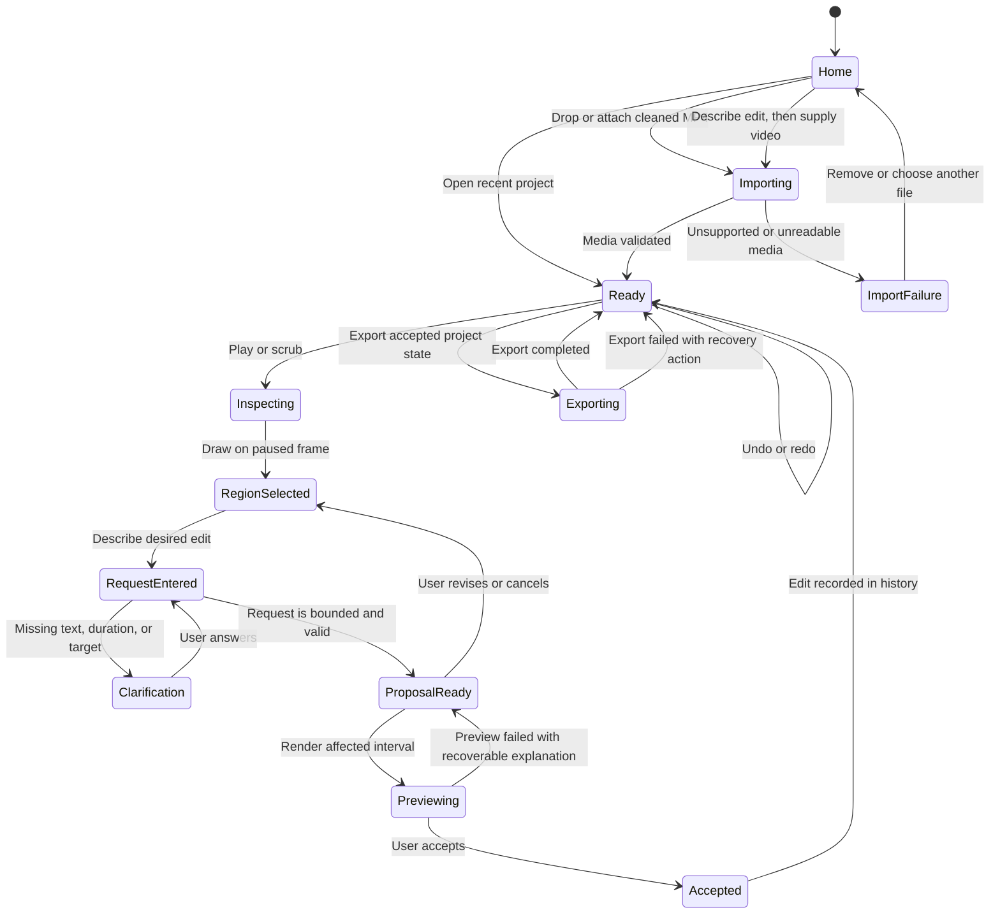

# G1 First-Edit Flow

Status: Owner review required before interface implementation.

## Primary job story

> When I am reviewing my cleaned talking-head video and notice a place that needs a nameplate, I want to pause, point to the area, and say what should appear, so I can preview and approve the edit in under a minute without learning layers, keyframes, coordinates, or render settings.

## First successful edit

1. The owner lands on Home and sees one central chat/upload composer rather than editing controls.
2. The owner drops in a cleaned MP4, attaches it in the composer, or opens a recent project.
3. The video becomes ready and the product transitions into the Studio.
4. The owner plays or scrubs to the desired moment.
5. The owner draws a rectangle where the nameplate should appear.
6. The owner writes: “Add Santosh — Founder here for five seconds.”
7. The system shows one structured proposal in plain language:
   - **What:** nameplate with “Santosh” and “Founder”
   - **Where:** the selected rectangle
   - **When:** current time through five seconds later
   - **Motion:** none in the first slice
8. The system renders a real preview of the affected interval.
9. The owner accepts, asks for a change, or cancels.
10. An accepted edit appears as one understandable item in history and the time strip.
11. The owner can undo it, reload the project, and export the same accepted result.

## What the user should not need to know

- Track numbers or layer IDs
- X/Y coordinates
- Codec, bitrate, filter graphs, or render commands
- Keyframes for a static nameplate
- JSON schemas or AI provider names
- File trees or database records

## Interface states

## State-by-state visible information

| State | Main canvas | Right panel | Time strip | Primary action |
|---|---|---|---|---|
| Home | One promise, central composer/drop zone, recent projects | Integrated into the central composer | Hidden | Drop, attach, describe, or open |
| Importing | Video placeholder and progress | Validation status | Hidden | Cancel |
| Ready/Inspecting | Video with play/pause and point/draw cursor | “What should change?” | Playhead and accepted edits | Describe edit |
| Region selected | Visible rectangle and time label | Request composer | Selected moment | Send request |
| Clarification | Selection remains visible | One concrete question | Unchanged | Answer |
| Proposal ready | Proposed overlay on frame | What/where/when summary | Proposed interval outlined | Preview |
| Previewing | Real rendered interval | Preview status and controls | Preview interval active | Accept or revise |
| Accepted | Accepted edit visible | History item with undo | Compact edit marker | Continue or export |
| Recoverable failure | Last trustworthy frame/state | Plain-language cause and next action | No false success marker | Retry or revise |

## Proposal language

The default proposal must read like an editor's confirmation, not machine output:

> Add a static two-line nameplate reading “Santosh” and “Founder” inside your selected area, starting at 00:18 and ending at 00:23. Preview this change?

Advanced details may reveal IDs, coordinates, or renderer diagnostics only when troubleshooting.

## First usability acceptance test

Without coaching on editing terminology, the owner can:

1. Understand how to begin from Home without seeing editing controls.
2. Identify where to drop or attach a video and where to describe the desired edit.
3. Understand why the Studio appears after a project is opened.
4. Identify how to point to a place on the video.
5. Understand what the proposal will change.
6. Distinguish preview from acceptance.
7. Find undo and export.

If any step requires explanation, revise the workflow before building a polished interface.

## Deliberately absent from the first screen

- Multitrack professional timeline
- Effect browser
- Transform inspector
- Asset filesystem
- AI model selector
- Render configuration
- Team, billing, and account administration
- Decorative dashboard metrics
